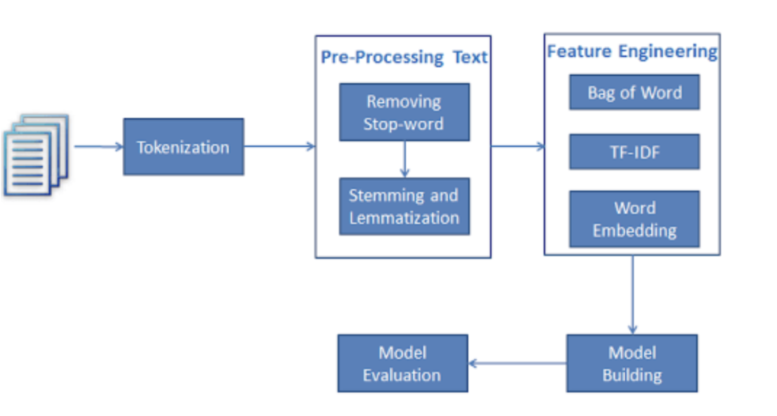

# Sentiment Analysis on Twitter. Hate Speech recognition

![Blight]

## Overview
Labeled racist, sexist, and homophobic tweets

## Business Problem
In our modern world we have freedom in sharing our thoughts, beliefs, criticizing other people and commenting their thoughts on different social media. It became possible also due to growing democracy both in the structure of different countries and in the use of social networks and the dissemination of people’s opinions through them.
Moreover, some individuals feel that it is natural to use hate speech with regard to other people on social media, but it is not respectful and polite towards persons who get this comments or who can simply notice this text with inappropriate vocabulary during scrolling other tweets. We can identify hate speech as injurious or undermining speech that communicates preference against a specific cluster, particularly on the premise of race, religion or sexual orientation.
Additionally, natural use of hate speech grows the culture of using impolitic vocabulary between new generations Z and Y.
Shockingly, each major tech company, counting Twitter, hires human mediators to a few degrees, both locally and abroad. Most of the social media platforms still don’t have moderate speech instruments which can automatically identify and correct hate speech or ban it and prevent the text with it from being published.

## Approach

General Approach for this problem was based on Cross Industry Standard Process for Data Mining (CRISP-DM)
Which includes all following pmpotrtant steps: 

1. Look at the big picture. 
2. Get the data. 
3. Discover and visualize the data to gain insights. 
4. Prepare the data for Machine Learning algorithms. 
5. Select a model and train it. 
6. Fine-tune your model. 
7. Present your solution. 
8. Launch, monitor, and maintain system.

    
    
## Methodology

Based on our business problem we are trying to accomplish certain tasks that involve natural language. NLP allows computers to interact with text data in a structured and sensible way. With NLP, computers are taught to understand human language, its meaning and sentiments. In order to translate complex natural human language into systematic constructed features we need to follow some major steps which showed on the next graph.

    

## Analysis

Data for this project was soursed from a study about Automated Hate Speech Detection and the Problem of Offensive Language conducted by team of Cornell University in 2017. Aditional data sourse from Association for Computational Linguistics provide us labeled data with tweets ID's that contain hate speech. Links to data sourses can be finded in references below.

During EDA we discovered that data from Cornell University appears to be inbalanced with minority class as hate speech and represented on a left side of the graph. After API requests with labeled as hate speech tweets ids we were able to bring more data to our project and balance it. Left side of the graph shows balanced data.
 

   
 
 

## Modeling

## Results

## Conclusion

## Future Work

## Repository Structure

    ├── README.md                    # The top-level README for reviewers of this project"
    ├── data                         # Synergized Data obtained from University of Michigan and Detroit Open Data Portal"
    ├── modules                      # py files with functions for ingeniring and modeling"
    ├── images                       # Both sourced externally and generated from Code"       
    ├── modeling.ipynb               # Notebook that gpes pver out modling process"                                        
    └── features_engineering.ipynb    # Notebook Used for feature engineering before Modeling"
    
    
**Authors**  
[Ivan Vanko](https://github.com/vanitoz) 
[Kelvin Arellano](https://github.com/Kelvin-Arellano) 
